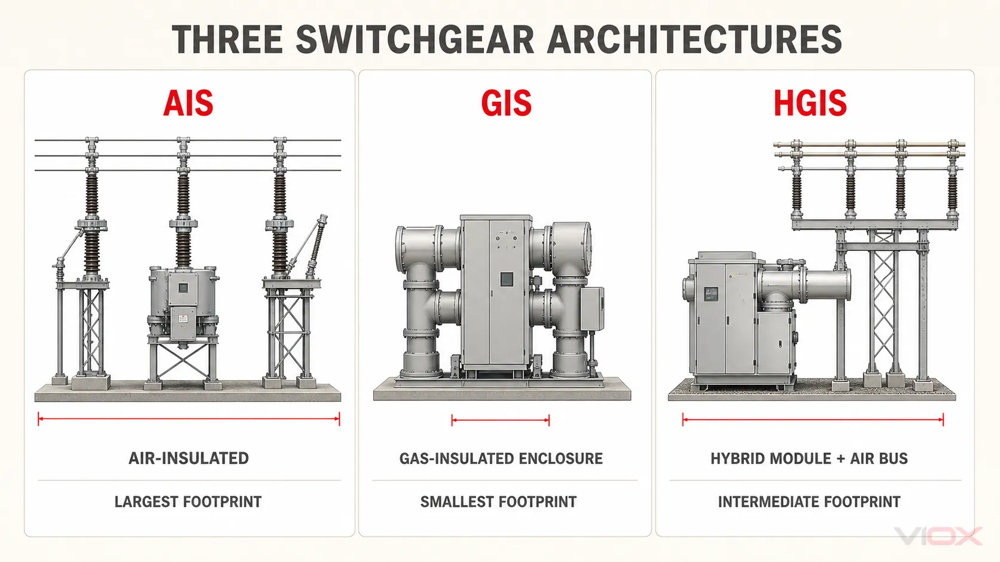
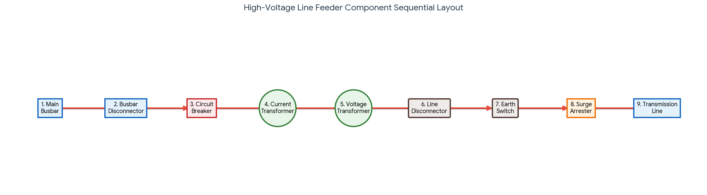

# 📖 Gün 01 — Şalt Mimarisi, Fider Yapısı ve Manevra Prosedürleri (Teknik Detaylar)

Bu doküman, 1. Gün çalışması kapsamında incelenen **OG/YG Şalt Mimarileri (AIS vs GIS)** ve **Fider Anatomisi** konularının teknik detaylarını, kriter karşılaştırmalarını ve saha standartlarını içermektedir.

---

## 1. OG ve YG Şalt Sahası Tipleri (AIS / GIS)

Orta Gerilim (OG: $1\text{ kV} - 36\text{ kV}$) ve Yüksek Gerilim (YG: $36\text{ kV}$ üstü) şalt sahaları; elektrik şebekesinde enerjinin güvenle yönlendirilmesini, kontrol edilmesini ve dönüştürülmesini sağlayan kritik merkezlerdir. Bu sahalarda kullanılan ekipmanların (kesici, ayırıcı, bara, ölçü trafoları) yalıtım biçimine göre sistemler temel olarak **AIS (Hava İzoleli Şalt)** ve **GIS (Gaz İzoleli Şalt)** olmak üzere iki türe ayrılır.

### 1.1. AIS (Air Insulated Switchgear) – Hava İzoleli Şalt Sahası

Ekipmanların fazlar arası ve toprak arası yalıtımının doğal hava ile sağlandığı geleneksel şalt sahası tipidir.

-   **Çalışma Mantığı:** Elektrik akımını taşıyan iletkenler ve teçhizatlar açık havadadır. Havanın yalıtkanlık direncinin düşük olması sebebiyle arklanmayı (atlamayı) önlemek için ekipmanlar arasına büyük fiziksel mesafeler (clearance) bırakılması zorunludur.
-   **Özellikleri:**
    -   Genellikle kırsal alanlarda, şehir dışlarında veya geniş arazi imkanı sunan endüstriyel tesislerde kurulur.
    -   Çevresel etkilere (yağmur, kar, fırtına, toz, kirlilik, kuşlar vb.) doğrudan açıktır.
    -   Yüksek dağlık bölgelerde (örneğin $2000\text{ m}$ üzeri rüzgar santralleri) rakım arttıkça havanın yalıtım özelliği düştüğü için ekstra izolasyon önlemi veya ekipman derating (güç düşürme) revizyonu gerektirir.

### 1.2. GIS (Gas Insulated Switchgear) – Gaz İzoleli Şalt Sahası

Tüm akım taşıyan iletkenlerin ve anahtarlama elemanlarının, dielektrik (yalıtkanlık) gücü yüksek olan $\text{SF}_6$ (Kükürt Hekzaflorür) gazı ile doldurulmuş, topraklanmış metal kapsüller/tanklar içerisine hapsedildiği sistemdir.

-   **Çalışma Mantığı:** $\text{SF}_6$ gazının yalıtım yeteneği havaya göre çok daha üstündür. Bu sayede yüksek gerilim altındaki elemanlar birbirine çok yakın (milimetrik seviyelerde) yerleştirilebilir.
-   **Özellikleri:**
    -   **Kompakt Tasarım:** AIS sahalara kıyasla 10 kata kadar daha az yer kaplar.
    -   Kentsel alanlarda (şehir merkezleri), yer altı trafo merkezlerinde, alanın çok kısıtlı olduğu dar vadilerde, hidroelektrik veya kıyı santrallerinde tek seçenektir.
    -   Dış ortamdan tamamen izole (kapalı modüler kabinler) olduğu için hava koşullarından, tozdan ve nemden etkilenmez; arıza sıklığı çok düşüktür.

---

### 📊 AIS ve GIS Doğrudan Karşılaştırması

| Kriter                   | AIS (Hava İzoleli)                             | GIS (Gaz İzoleli)                                             |
| :----------------------- | :--------------------------------------------- | :------------------------------------------------------------ |
| **Yalıtım Malzemesi**    | Ortam Havası                                   | $\text{SF}_6$ Gazı (Kükürt Hekzaflorür)                       |
| **Alan İhtiyacı**        | Çok yüksek (Geniş arazi gerekir)               | Çok düşük (AIS'e göre ~%10'u kadar yer kaplar)                |
| **İlk Kurulum Maliyeti** | Düşük / Ekonomik                               | Yüksek (Ekipman ve gaz maliyetinden ötürü)                    |
| **Çevresel Duyarlılık**  | Yüksek (Toz, nem, fırtına performansı düşürür) | Yok (Sızdırmaz metal muhafaza korumalıdır)                    |
| **Bakım İhtiyacı**       | Sık ve düzenli bakım ister                     | Çok az bakım gerektirir                                       |
| **Çevreye Etki**         | Görsel kirlilik oluşturur                      | $\text{SF}_6$ sera gazı olduğundan gaz kaçak takibi kritiktir |
| **Güvenlik**             | Canlı parçalar açıktadır                       | Dokunulabilir tüm yüzeyler topraklanmış metaldir              |

---

### ⚙️ OG ve YG Seviyelerinde Kullanım Trendleri

-   **Orta Gerilimde (OG):** Endüstriyel tesisler, fabrikalar ve şehir içi dağıtım şebekelerinde bina içinde yer kazanmak ve nemli/tozlu ortamlardan korunmak için kompakt GIS hücreler veya kompakt RMU (Ring Main Unit) yapıları sıklıkla tercih edilir. Eğer elektrik odasında yer kısıtlaması yoksa, maliyet avantajı için AIS hücreler de yaygın olarak kullanılır.
-   **Yüksek Gerilimde (YG):** $154\text{ kV}$ ve $400\text{ kV}$ gibi iletim şebekelerinde, AIS şalt sahaları devasa alanlar (dönümlerce arazi) kaplar. Şehir içi trafo merkezlerine yüksek gerilim getirilmesi gerektiğinde arazinin pahalı veya imkansız olması sebebiyle mutlaka bina içi/yer altı YG GIS trafo merkezleri inşa edilir.

---

## 2. Fider Anatomisi ve Bileşen Yerleşim Sırası

Elektrik sistemlerinde **fider**, bir trafo merkezinde veya şalt sahasında baradan çıkan ve tüketici grubuna ya da başka bir merkeze enerji taşıyan hat/kablo çıkış devresidir. Güvenli ve sürdürülebilir bir enerji akışı sağlamak için fiderlerin belirli bir ekipman yerleşim sırası bulunur.

Bir hat fiderini oluşturan temel bileşenler, **ana baradan (enerji kaynağından) çıkış hattına (tüketiciye) doğru** sırasıyla şu şekilde dizilir:

`Bara ➔ Bara Ayırıcısı ➔ Kesici ➔ Akım Trafosu ➔ Gerilim Trafosu ➔ Hat Ayırıcısı ➔ Toprak Ayırıcısı ➔ Parafudr`

---

### ⚡ Fideri Oluşturan Bileşenler ve Görevleri

1. **Bara (Busbar):** Enerjinin toplandığı ve fiderlere dağıtıldığı ana iletken profillerdir. Sıralamanın en başında yer alır.
2. **Bara Ayırıcısı (Busbar Disconnector):** Fideri ana baradan fiziksel olarak yalıtmak amacıyla baradan hemen sonra konumlandırılır. Klasik ayırıcılar yük altında (akım geçerken) kesinlikle açılıp kapatılamaz.
3. **Kesici (Circuit Breaker / Disjonktör):** Fiderin en kritik elemanıdır. Normal işletme yüklerini ve arıza anındaki yüksek kısa devre akımlarını güvenli bir şekilde kesebilen tek şalt cihazıdır. Bara ayırıcısından hemen sonra gelir.
4. **Akım Trafosu (Current Transformer - CT):** Kesicinin ardına (veya fider tipine göre önüne) yerleştirilir. Hattan geçen yüksek akımı koruma röleleri ve SCADA sistemleri için ölçülebilir seviyelere ($1\text{A}$ veya $5\text{A}$) indirir.
5. **Gerilim Trafosu (Voltage Transformer - VT):** Hattın gerilimini ölçmek ve koruma sistemlerini beslemek için fider üzerine paralel olarak bağlanır ($100\text{V}$ veya $110\text{V}$).
6. **Hat Ayırıcısı (Line Disconnector):** Kesici ve ölçü trafolarından sonra, hattın çıkış noktasına yakın yerleştirilir. Fiderin hattan gelebilecek geri beslemelere veya ters enerjilere karşı tamamen izole edilmesini sağlar.
7. **Toprak Ayırıcısı (Earth Switch):** Hat ayırıcısının hemen çıkışında bulunur. Bakım ve onarım çalışmalarından önce, hat üzerinde biriken statik veya kapasitif yükü toprağa aktararak personelin can güvenliğini sağlar.
8. **Parafudr (Surge Arrester):** Şalt sahasının en dış sınırında, hattın fidere giriş yaptığı en uç noktada yer alır. Yıldırım düşmesi veya hat manevraları kaynaklı aşırı gerilim dalgalarını toprağa ileterek fider içindeki hassas ekipmanları korur.

---

# 🔒 Şalt Sahalarında ve Modüler Hücrelerde Kilitleme (Interlock) Sistemleri

Şalt sahalarında ve modüler hücrelerde kilitleme (interlock) sistemleri; insan hayatını korumak ve milyonlarca liralık şalt teçhizatının hatalı manevra nedeniyle patlamasını/zarar görmesini önlemek amacıyla kurulan **elektriksel ve mekanik güvenlik zincirleridir**.

> ⚡ **Temel İşletme Felsefesi:**
> Yük altında (akım geçerken) ayırıcı açıp kapatmayı engellemek ve enerjili hatları/baraları topraklamamaktır.

---

## 1. Mekanik Kilitleme (Mechanical Interlock)

Mekanik kilitleme, şalt cihazlarının tahrik mekanizmaları (kollar, miller, mandallar) arasına yerleştirilen fiziksel engellerdir. Genellikle orta gerilim (OG) _metal-clad_ veya _metal-enclosed_ modüler hücrelerde tercih edilir. Cihazlar aynı pano içinde ve birbirine yakın olduğu için çelik miller veya özel kilit göbekleri yardımıyla güvenlik zinciri oluşturulur.

### 🛡️ En Temel Kurallar:

-   **Kesici - Ayırıcı Kilidi:** Kesici **KAPALI** (yani devrede akım var) pozisyondayken, ayırıcının manevra kolu yuvasına bir mil girerek kolun dönmesini fiziksel olarak engeller. Ayırıcıyı açabilmeniz için kesiciyi **AÇIK** pozisyona getirmeniz şarttır.
-   **Ayırıcı - Toprak Bıçağı Kilidi:** Hat/Bara ayırıcısı **KAPALI** (sistem enerjili) iken toprak ayırıcısının kol yuvası mekanik bir perdeyle kapatılır, kolu içeri sokamazsınız. Ayırıcı açıldığında bu perde kayar ve toprak kolu takılabilir hale gelir.
-   **Hücre Kapısı Kilidi:** Toprak ayırıcısı **KAPALI** (hat tamamen güvenli ve topraklanmış) konumda değilse, hücrenin erişim kapısı mekanik olarak kilitlidir, açılamaz.

---

## 2. Elektriksel Kilitleme (Electrical Interlock)

Yüksek gerilim (YG) açık şalt sahalarında cihazlar (kesici, bara ayırıcısı, hat ayırıcısı) birbirinden onlarca metre uzaktadır. Bu mesafelerde mekanik mil kullanılamayacağı için **elektriksel kilitleme** devreye girer.

Bu sistem, cihazların kurma, açma ve kapama bobinlerinin besleme hatlarına (genellikle $110\text{V}$ veya $220\text{V DC}$) seri olarak bağlanan **yardımcı kontaklar** vasıtasıyla çalışır. Eğer güvenlik şartı sağlanmadıysa, siz butona bassanız veya SCADA’dan emir gönderseniz bile bobine elektrik gitmez ve cihaz hareket etmez.

       [ + 110V DC Kumanda Barası ]
                   │
                   ▼
       ┌────────────────────────┐
       │   Toprak Kapatma       │  👉 Operatörün SCADA'dan bastığı
       │   Butonu / Komutu      │     veya panodan çevirdiği buton.
       └───────────┬────────────┘
                   │
                   ▼
       ┌────────────────────────┐
       │  Hat Ayırıcısı Yardımcı│  ⚠️ Kural: Hat ayırıcısı AÇIK ise bu kontak
       │  Kontak (AÇIK Pozisyon)│     kapalıdır ve elektriği geçirir.
       └───────────┬────────────┘
                   │
                   ▼
       ┌────────────────────────┐
       │ Bara Ayırıcısı Yardımcı│  ⚠️ Kural: Bara ayırıcısı da AÇIK olmalıdır.
       │  Kontak (AÇIK Pozisyon)│     Böylece hatta hiç enerji kalmadığı kesinleşir.
       └───────────┬────────────┘
                   │
                   ▼
       ┌────────────────────────┐
       │ Toprak Ayırıcısı       │  ⚡ Akım buraya ulaşırsa bobin çeker
       │ Kapatma Bobini (Yolcu) │     ve toprak bıçakları kapatılır.
       └───────────┬────────────┘
                   │
                   ▼
       [ - DC Dönüş Barası ]

---

## 3. Mantıksal Analiz (Doğruluk Tablosu)

Bir hat fiderindeki 3 ana şalt cihazının (Kesici, Hat Ayırıcısı, Toprak Ayırıcısı) birbirine göre izin verilen durum analizi şu şekildedir:

|    Kesici (CB) Pozisyonu    | Hat Ayırıcısı (DS) Pozisyonu | Toprak Ayırıcısı (ES) Pozisyonu | Manevra İzin Durumu / Sonuç                                                              |
| :-------------------------: | :--------------------------: | :-----------------------------: | :--------------------------------------------------------------------------------------- |
| **KAPALI** _(Akım Geçiyor)_ |          **KAPALI**          |            **AÇIK**             | **Normal İşletme Durumu.** Hiçbir ayırıcı hareket ettirilemez.                           |
|   **AÇIK** _(Akım Kesik)_   |          **KAPALI**          |            **AÇIK**             | Hat Ayırıcısı açılabilir. Toprak ayırıcısı kilitlidir (DS kapalı olduğu için).           |
|   **AÇIK** _(Akım Kesik)_   |           **AÇIK**           |            **AÇIK**             | **Güvenli Bölge.** Bara/Hat ayırıcıları da, Toprak ayırıcısı da kapatılabilir.           |
|   **AÇIK** _(Akım Kesik)_   |           **AÇIK**           |           **KAPALI**            | **Hat Topraklı (Bakım Pozisyonu).** Kesici ve Hat Ayırıcısı kapatılamaz.                 |
|      **KAPALI / AÇIK**      |          **KAPALI**          |           **KAPALI**            | ❌ **YASAK KONUM (Kısa Devre)!** Interlock sistemi bu kombinasyonun oluşmasını engeller. |

---

## 4. Örnek Senaryo Analizleri

### 🔴 Senaryo A: Fideri Bakıma Alma (Enerji Kesme - Devre Dışı Bırakma)

Sistemde akım akarken doğrudan ayırıcıyı açmaya çalışırsanız oluşacak ark havayı iyonize eder, fazlar arası kısa devreye neden olur ve şalt sahasını patlatır.

-   **Hedef:** Toprak ayırıcısını kapatıp hattı emniyete almak.
-   **Elektriksel Blokaj:** Toprak ayırıcısı bobini hat ayırıcısının "AÇIK" yardımcısına bağlıdır. Hat ayırıcısı ise kesicinin "AÇIK" yardımcısına bağlıdır.
-   **🔄 Çözüm Sıralaması:**
    1. Önce **Kesici açılır** ➔
    2. Hat Ayırıcısı üzerindeki blokaj kalkar ve **Hat Ayırıcısı açılır** ➔
    3. Toprak Ayırıcısı üzerindeki blokaj kalkar ve **Toprak Bıçağı kapatılır**.

### 🟢 Senaryo B: Bakım Sonrası Fidere Yeniden Enerji Verme (Devreye Alma)

Topraklı bir hatta doğrudan enerji vermek hatayı direkt toprağa basmak (faz-toprak kısa devresi) demektir.

-   **Hedef:** Kesiciyi kapatıp akım akışını başlatmak.
-   **Elektriksel Blokaj:** Hat ayırıcısının kapama devresi, Toprak ayırıcısının "AÇIK" kontağından geçer. Kesicinin kapama devresi ise Hat ve Bara ayırıcılarının "KAPALI" kontaklarından geçer.
-   **🔄 Çözüm Sıralaması:**
    1. Önce **Toprak Ayırıcısı açılır** (toprak kaldırılır) ➔
    2. **Hat ve Bara Ayırıcıları kapatılır** ➔
    3. En son **Kesici kapatılarak** sisteme güvenle enerji verilir.

---

## 5. Bypass (Kilitleme İptal) Anahtarı

Şalt sahalarında kontrol panolarının üzerinde veya SCADA ekranlarında **"Interlock Bypass" (Kilitleme İptal)** anahtarları bulunur.

-   **Neden Var?** Cihazların konumunu bildiren yardımcı kontaklar arızalandığında veya fiziksel bir takılma olduğunda, acil durumlarda sistemi yönetebilmek için bu güvenlik zincirini geçici olarak devre dışı bırakmak gerekir.
-   **⚠️ Taşıdığı Risk:** Bypass anahtarı çevrildiği an sistem kör olur. Operatörün yapacağı en ufak bir insan hatası (örneğin yük altında ayırıcı açmak) şalt sahasında ölümcül bir kazaya veya trafo patlamasına yol açabilir. Bu nedenle bypass manevraları sadece yetkili şeflerin gözetiminde ve yazılı **"Manevra Fişi"** protokolleriyle yapılır.
