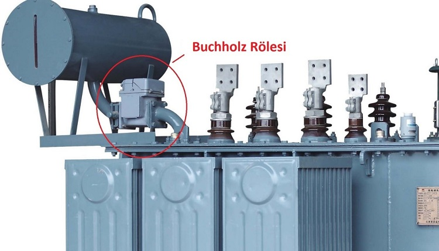
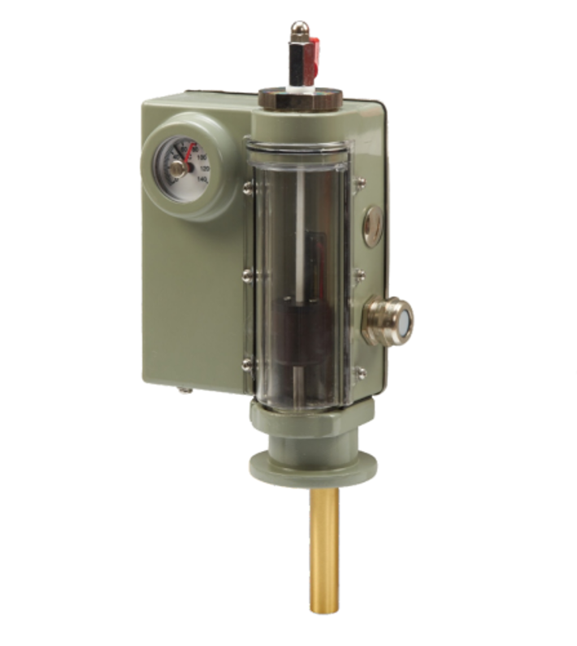

# 📖 Gün 02 — Güç Trafoları Mimarisi, Vektör Grupları ve Saha Testleri (Teknik Detaylar)

Güç trafoları, şalt sahalarının ve iletim/dağıtım şebekesinin en yüksek maliyetli ve en kritik ekipmanlarıdır. Bu dökümanda trafo bağlantı tipleri, vektör grubu okuma mantığı, saha test prosedürleri ve mekanik koruma ekipmanları detaylandırılmıştır.

---

## 1. Trafo Bağlantı Grupları ve Vektör Açısı Mantığı

Trafo sargılarının bağlantı şekli (Üçgen, Yıldız, Zigzag) ve faz vektörlerinin yönü, sistem paralel çalıştırılacağı zaman hayati önem taşır. Paralel bağlanacak trafoların vektör grupları birebir aynı olmak zorundadır.

### 1.1. Harf ve Rakam Kodlaması

-   **YG Sargısı (Primer):** Büyük harfle gösterilir ($D, Y, Z$). Nötr hattı varsa $N$ eklenir.
-   **AG/OG Sargısı (Sekonder):** Küçük harfle gösterilir ($d, y, z$). Nötr hattı varsa $n$ eklenir.
-   **Saat Açısı (Phase Displacement):** YG gerilim vektörü saat üzerinde **12 (veya 0)** kabul edilir. AG gerilim vektörünün YG'ye göre faz farkı saatin akrebi gibi düşünülerek hesaplanır.
    $$\text{Faz Farkı} = \text{Saat Sayısı} \times 30^\circ$$

### 1.2. Sık Karşılaşılan Vektör Grupları Analizi

1. **Dyn11:**

    - **D:** Primer Üçgen (Delta) bağlı.
    - **y:** Sekonder Yıldız (Star) bağlı.
    - **n:** Sekonderde Nötr noktası dışarı çıkarılmış (Nötr topraklanabilir).
    - **11:** Sekonder gerilimi, Primer geriliminin $330^\circ$ önündedir (Saat 11 yönü = $11 \times 30^\circ = 330^\circ$).
    - _Kullanım Alanı:_ OG/AG Dağıtım trafoları (örneğin $34.5\text{ kV} / 0.4\text{ kV}$). Üçgen primer, 3. harmonikleri hapseder; yıldız sekonder ise nötr hattı vererek dengesiz yükleri beslemeye izin verir.

2. **YNd11:**
    - **YN:** Primer Yıldız bağlı ve Nötr noktası topraklanabilir.
    - **d:** Sekonder Üçgen bağlı.
    - **11:** Sekonder gerilimi $330^\circ$ ileridedir.
    - _Kullanım Alanı:_ Santral jeneratör çıkış yükseltici trafoları veya yüksek gerilim iletim trafoları ($154\text{ kV} / 34.5\text{ kV}$).

---

## 2. Saha Kabul ve Periyodik Trafo Testleri

Saha Test ve Devreye Alma (TDA) mühendisleri, trafo enerjilenmeden önce sargı ve izolasyon durumunu doğrulamak için standart IEC 60076 testlerini uygular.

### 2.1. TTR (Transformer Turns Ratio / Çevrim Oranı) Testi

-   **Amaç:** Primer ve Sekonder sarım sayıları arasındaki oranı doğrulayarak imalat hatası, nakliye esnasında sargı kayması veya kademe değiştiricinin (Tap Changer) hatalı durumunu tespit etmek.
-   **Uygulama:** Trafoya düşük gerilim ($10\text{V} - 100\text{V AC}$) uygulanır, her kademede ($Tap$) tüm fazlar için gerilim oranı ölçülür.
-   **Kabul Kriteri:** Ölçülen değer, etiket değerinden en fazla **%0.5 (binde 5)** sapma gösterebilir.

### 2.2. İzolasyon Direnci (Megger Testi) ve Polarizasyon İndeksi (PI)

-   **Amaç:** Sargıların birbiriyle ve tank gövdesiyle olan izolasyon kalitesini, nem ve kirlilik durumunu belirlemek.
-   **Uygulama:** Yüksek DC gerilim ($2.5\text{ kV}$ veya $5\text{ kV}$) uygulanır. Ölçümler şu kombinasyonlarda yapılır:
    -   Primer ➔ Sekonder + Gövde (Tank)
    -   Sekonder ➔ Primer + Gövde
    -   Primer + Sekonder ➔ Gövde
-   **Polarizasyon İndeksi (PI) ve DAR Hesabı:**
    $$\text{PI} = \frac{R_{10\text{ dk}}}{R_{1\text{ dk}}}$$
    $$\text{DAR (Dielectric Absorption Ratio)} = \frac{R_{1\text{ dk}}}{R_{30\text{ sn}}}$$
-   **Kabul Kriteri:** PI değeri **$> 2.0$** olmalıdır. $1.5$'in altındaki değerler sargıda nem veya kir birikimini gösterir.

### 2.3. DC Sargı Direnci (Winding Resistance) Testi

-   **Amaç:** Sargı iletkenlerindeki kopuklukları, paralel kollardaki dengesizlikleri, klemens/buşing bağlantı gevşekliklerini ve Kademe Değiştirici kontak dirençlerini ölçmek.
-   **Uygulama:** DC akım (genelde $1\text{A} - 10\text{A}$) verilerek sargı doyuma ulaştırılır ve gerilim düşümünden direnç hesaplanır.
-   **Kabul Kriteri:** Fazlar arası direnç farkı **%2'yi geçmemelidir**. (Sıcaklık düzeltmesi $75^\circ\text{C}$ standart referansına göre yapılır).

---

## 3. Mekanik ve Fiziksel Koruma Ekipmanları

Trafo üzerindeki mekanik korumalar, elektriksel rölelerden bile hızlı tepki verebilen ilk savunma hattıdır.

1. **Buchholz Rölesi:**
    - Yağlı ve genleşme depolu trafolarda ana kazan ile yağ deposu arasındaki boruya monte edilir.
    - Sargılardaki küçük arklarda oluşan gaz birikmesi şamandırayı düşürür ➔ **ALARM**.
    - Büyük kısa devrelerde oluşan ani yağ akışı klapeyi iter ➔ **TRIP (AÇMA)**.
    
2. **Sıcaklık Termometreleri:**
    - **Üst Yağ Sıcaklığı ($Oil\ Temp$):** Trafo yağının tepe sıcaklığını ölçer.
    - **Sargı Sıcaklığı ($Winding\ Temp$):** Yağ sıcaklığına ilave olarak geçen akımın etkisi simüle edilerek en sıcak nokta ($Hotspot$) hesaplanır.
3. **Hermetik Koruma Rölesi (DGPT2 / RIS):**
    - Genleşme deposuz (hermetik) trafolarda gaz birikmesi, aşırı basınç, sıcaklık ve seviye kontrolünü tek bir gövdede toplar.
    
